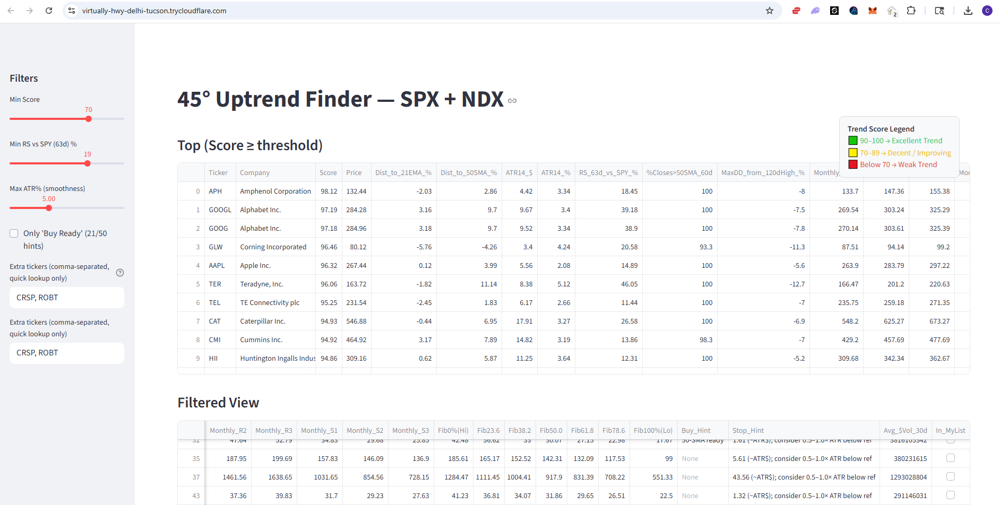
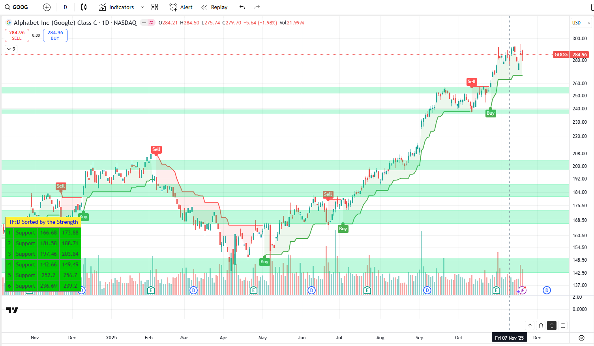

# 45Degree Uptrend Stocks Finder

A stock trend-analysis system that scores stocks based on strong 45°-angle uptrend behavior using price structure, moving averages, ATR, RS, and trend smoothness.

Python + Streamlit dashboard.








## What is this?

`45Degree-Uptrend-Finder` is a Python + Streamlit tool that does **Step 1** of your workflow:

> **Find the strongest, cleanest 45°-style uptrends in the market**, then you manually apply **Supertrend** + your **universal 5% up/down rules** on a chart to decide if/when to trade.

It scans a universe of stocks (S&P 500 + Nasdaq 100 + your own extra tickers), scores their trend quality from **0–100**, and surfaces the ones behaving like stable, institutional-style uptrends.

------

## Tech Stack / Libraries

**Core stack**

- **Python**
- **pandas** – time-series manipulation and indicators
- **numpy** – numeric operations
- **scipy.stats.linregress** – regression slope + R² for trend quality
- **yfinance** – historical OHLCV data + earnings calendar
- **requests** – scrape index constituents from Wikipedia
- **streamlit** – lightweight web UI for exploration (filters, tables)
- **pyngrok / cloudflared** (optional) – expose Streamlit app from Google Colab

You typically run this in **Google Colab** or locally (e.g. WSL Ubuntu) and then optionally launch the Streamlit dashboard.

------

## Universe and Data

1. **Universe construction**

   - Pulls **S&P 500** tickers from Wikipedia
   - Pulls **Nasdaq 100** tickers from Wikipedia
   - Optionally appends:
     - A manual list `MORE_TICKERS` (names you care about)
     - (In your latest version) a watchlist `MYLIST` that is always included and shown separately in the UI
   - Removes a few odd symbols (like `BRK.B`, `BF.B` Yahoo quirks)
   - Adds **SPY** as a benchmark for relative strength

2. **Historical data**

   - Uses **yfinance** to download about **420 trading days** of **daily OHLCV** for each ticker:
      `SCAN_PERIOD = "420d"`, `SCAN_INTERVAL = "1d"`

3. **Liquidity + event filters**

   - Drops any ticker with **too little history** (`len(df) < 220`)

   - Drops illiquid names with **average 30-day dollar volume**:

     ```
     MIN_DOLLAR_VOLUME = 20_000_000  # price * volume
     ```

   - Optionally skips names with **earnings inside X days**:

     ```
     EARNINGS_WINDOW_DAYS = 7
     ```

     using `yfinance.Ticker(t).get_calendar()` (you don’t want to pick something right into earnings for this scanner).

------

## Indicators & Metrics

For each stock, the script computes:

- **Moving averages**

  - 21-day EMA
  - 50-day SMA
  - 100-day SMA
  - 200-day SMA

- **Volatility**

  - ATR(14) in dollars
  - ATR% = `ATR(14) / Close * 100`

- **Trend behavior**

  - Whether the **MA stack** is bullish:

    > 21 EMA > 50 SMA > 100 SMA > 200 SMA

  - Whether all four MAs are **rising over the last ~20 bars**

- **Regression trend quality**

  - Linear regression on **log(close)** over the last 120 days
  - Use **slope** (direction) and **R²** (trend straightness / smoothness)

- **Relative Strength vs SPY**

  - 63-day return of stock vs 63-day return of SPY
  - `RS_63d_vs_SPY_% = stock_return – spy_return`

- **Trend persistence**

  - `% of closes above the 50-day SMA** over the last 60 days

- **Drawdown**

  - Max drawdown from the **last 120-day high**

- **Reference levels (for context, not score)**

  - Monthly pivot + R1/R2/R3, S1/S2/S3 from the recent month
  - Fibonacci levels between recent high/low (23.6, 38.2, 50, 61.8, 78.6%)

The pivot / fib levels are for **manual use** later (e.g., potential targets or support), not directly in the Score.

------

## Trend Score (0–100)

Each ticker gets a **composite Trend Score** built from several components. Weights:

```
WEIGHTS = dict(
    ma_stack=20,    # MA alignment
    ma_slopes=15,   # all MAs rising
    regression=25,  # 120d regression slope + R²
    rs=15,          # 63d RS vs SPY
    atrp=15,        # ATR% (smooth, not noisy)
    above50=10,     # % closes above 50SMA
)

ATR_PCT_MAX = 5.0      # ideal upper bound for ATR%
R2_MIN      = 0.60     # minimum R² to start scoring regression
RS_BONUS    = 10.0     # RS cap (+10% vs SPY)
ABOVE50_MIN = 80.0     # ideal % closes above 50SMA
```

Scoring logic (simplified):

1. **MA stack (up to 20 pts)**

   - If 21EMA > 50SMA > 100SMA > 200SMA → add `WEIGHTS["ma_stack"]`.

2. **Rising MAs (up to 15 pts)**

   - If all 4 MAs are higher than they were ~20 bars ago → add `WEIGHTS["ma_slopes"]`.

3. **Regression trend quality (up to 25 pts)**

   - If slope > 0 and R² ≥ R2_MIN:

     - Scale points based on how strong R² is:

       ```
       score += WEIGHTS["regression"] * min(1.0, (reg_r2 - R2_MIN)/(1.0 - R2_MIN))
       ```

4. **Relative Strength vs SPY (up to 15 pts)**

   - If 63d RS > 0:

     ```
     score += WEIGHTS["rs"] * min(1.0, rs_diff / RS_BONUS)
     ```

     So +10% RS gets full RS credit.

5. **ATR% (up to 15 pts, penalizes noisy names)**

   - If `ATR% <= ATR_PCT_MAX` (e.g. ≤ 5%) → full `WEIGHTS["atrp"]`

   - If ATR% is higher, scale down over the next ~5 percentage points:

     ```
     if atr_pct <= ATR_PCT_MAX:
         score += WEIGHTS["atrp"]
     else:
         dec = max(0.0, min(1.0, 1.0 - (atr_pct - ATR_PCT_MAX)/5.0))
         score += WEIGHTS["atrp"] * dec
     ```

6. **% Closes above 50SMA (up to 10 pts)**

   - If `%Closes>50SMA_60d >= ABOVE50_MIN` (e.g. 80%) → full `WEIGHTS["above50"]`
   - Otherwise, it scales down the credit based on how close it is to 80%.

Total score is capped at **100**.

You interpret it roughly as:

- 🟩 **90–100** → Excellent / elite 45°-style trend
- 🟨 **70–89** → Decent / okay / neutral-to-improving
- 🟥 **Below 70** → Weak / choppy / avoid for this strategy

------

## Output & Workflow

At the end of the scan, the script:

- Builds a `pandas.DataFrame` of all tickers and metrics
- Sorts by `Score` (and RS as tiebreaker)
- Saves CSVs like:
  - `uptrend_finder_full.csv` – all scanned tickers + metrics
  - `uptrend_finder_top.csv` – only names with `Score >= PASS_SCORE` (e.g. 70)
  - (In your updated version) `uptrend_finder_mylist.csv` – your personal watchlist only

If `RUN_STREAMLIT = True`, it also:

- Writes an `app.py` Streamlit app
- Launches it in Colab
- Exposes it externally via **ngrok** or **Cloudflare (cloudflared)** so you can interact with:
  - Top list (Score ≥ threshold)
  - Filtered view (Score, RS, ATR% filters)
  - Separate **MyList** section for tickers you care about most

------

## How you use it (your trading workflow)

1. **Run 45.py** to:
   - Filter for liquid, non-earnings-tomorrow stocks
   - Score trend quality across your universe
   - Get a ranked list of the strongest, smoothest uptrends
2. **From that list**, you:
   - Open charts on your own platform like Trading View
   - Overlay:
     - **Supertrend**
     - Your **universal 5% up/down signals**
   - Manually avoid chop and time entries / exits

This repo is **not** a signal generator.
 It is a **candidate finder** — a structured, repeatable way to find “45° angle” trending stocks worth your time, so you can then apply your discretionary Supertrend + 5% rules on top.


